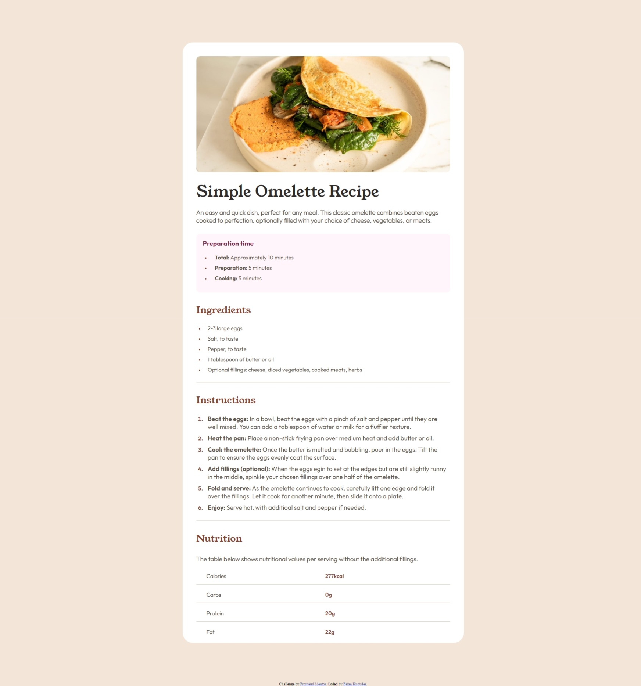
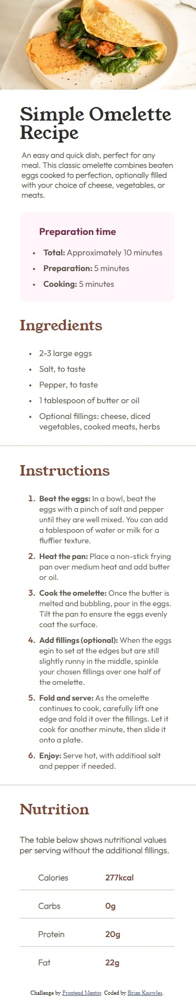

# Recipe Page Solution

This repository contains my solution to the Recipe page challenge from [Frontend Mentor](https://www.frontendmentor.io/challenges/recipe-page-KiTsR8QQKm). Frontend Mentor challenges provide an excellent opportunity to enhance coding skills by working on realistic projects.

## Table of Contents

- [Overview](#overview)
  - [The Challenge](#the-challenge)
  - [Screenshots](#screenshots)
  - [Links](#links)
- [My Process](#my-process)
  - [Built With](#built-with)
  - [Key Learnings](#key-learnings)
  - [Future Development](#future-development)
  - [Helpful Resources](#helpful-resources)
- [Author](#author)
- [Acknowledgments](#acknowledgments)

## Overview

### The Challenge

The challenge was to create a recipe page that is responsive and visually appealing. The page should display the recipe details and ingredients in an organized layout.

### Screenshots

### Links

- [Solution URL](https://www.frontendmentor.io/solutions/prophesierc-recipepagemain-kS2ZZxZPx1)
- [Live Site URL](https://prophesierc.github.io/recipe-page-main/)

## My Process

### Key Learnings

While working on this project, I reinforced my understanding of HTML semantics and improved my multi device functionality structures.

### Future Development

In future projects, I aim to delve deeper into mobile-first CSS structures as well as more consistent display and positioning methods.

## Author

## Acknowledgments

I'd like to acknowledge the Frontend Mentor community for providing an excellent platform to enhance coding skills through real-world projects.
